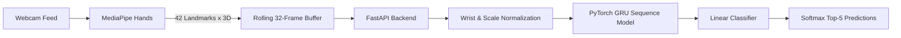

<div align="center">

# SignBridge

### Real-time American Sign Language recognition & learning

An open-source platform for translating American Sign Language (ASL) into text and supporting interactive learning. The system uses hand landmark tracking, a PyTorch GRU neural network, and a FastAPI backend.

<a href="https://github.com/swastikparmar987/signbridge/actions"></a>
<a href="https://github.com/swastikparmar987/signbridge/releases"></a>
<a href="https://github.com/swastikparmar987/signbridge/blob/main/LICENSE"></a>

</div>

---

## Overview

SignBridge processes live webcam input to detect and recognize ASL gestures in real time. It also includes a learning mode with demonstrations for each sign.

**Built with:**
- [MediaPipe Hands](https://mediapipe.dev/) for landmark tracking
- [PyTorch](https://pytorch.org/) GRU network for sequence classification
- [FastAPI](https://fastapi.tiangolo.com/) backend serving the web interface and API

---

## Quick Start

### 1. Clone and install

```bash
git clone https://github.com/swastikparmar987/signbridge.git
cd signbridge
python3 -m venv .venv
source .venv/bin/activate
pip install -r requirements.txt
```

### 2. Start the server

```bash
python -m uvicorn signbridge.web.app:app --host 0.0.0.0 --port 8000 --reload
```

### 3. Open

Navigate to [http://localhost:8000](http://localhost:8000).

---

## Features

| Capability | Description |
|---|---|
| Live Recognition | Real-time webcam gesture recognition with Top-1 and Top-5 predictions |
| Video Upload | Analyze offline recordings (`.mp4`, `.mov`, `.webm`) |
| Learn & Practice | Browse sign definitions, watch demo clips, practice live with scoring |
| Diagnostic Panel | Press `D` during camera use to toggle a telemetry overlay |
| API Access | REST endpoints for health checks, predictions, and vocabulary lookup |

---

## How to Use

1. Click **Start Camera** and sign naturally. Predictions appear ranked by confidence.
2. Or drag a video file onto the interface for offline analysis.
3. Use the **Learn** section to browse 2,731 signs, view demos, and practice with real-time feedback.

---

## Architecture



### Model Details

| Parameter | Value |
|---|---|
| Model Type | Gated Recurrent Unit (`GRUClassifier`) |
| Input Shape | `[Batch, 32, 126]` — 32 frames x 126 landmark coordinates |
| Hidden Units | 256 |
| Vocabulary | 2,731 ASL glosses |
| Checkpoint | `trained_models/best_gru_normalized.pth` (~16 MB) |
| Top-1 Accuracy | 34.84% |
| Top-5 Accuracy | 61.54% |

Accuracy measured over 32,941 test samples from the ASL Citizen dataset.

---

## REST API

| Method | Route | Description |
|---|---|---|
| `GET` | `/api/health` | Health check, device info, active class count |
| `POST` | `/api/predict/sequence` | Predict from raw JSON landmark sequence |
| `POST` | `/api/predict/video` | Batch inference from uploaded video file |
| `GET` | `/api/vocabulary` | Paginated dictionary with search filtering |
| `GET` | `/api/demonstration/{gloss}` | Demo video metadata for a gloss |
| `GET` | `/api/teach-me` | Random curated sign for discovery |

---

## CLI Tools

```bash
# Verify the full pipeline
python -m signbridge.inference.verify_pipeline

# Predict from a video file
python -m signbridge.inference.predict_video --video path/to/sample.mp4
```

---

## Project Structure

```
signbridge/
├── signbridge/
│   ├── inference/          # Model, predictor, pipeline verification
│   ├── preprocessing/      # Landmark extraction and normalization
│   └── web/                # FastAPI app, templates, CSS, JS
├── trained_models/         # Model checkpoints
├── requirements.txt
└── README.md
```

---

## Development

See [README_DEPLOYMENT.md](README_DEPLOYMENT.md) for teammate setup, environment configuration, dataset requirements, and troubleshooting.

---

## License

This project is licensed under the terms specified in [LICENSE](LICENSE).

---

<div align="center">

Contributions and bug reports are welcome. Open an issue or submit a pull request.

<a href="https://github.com/swastikparmar987/signbridge/stargazers"></a>
<a href="https://github.com/swastikparmar987/signbridge/network/members"></a>

</div>